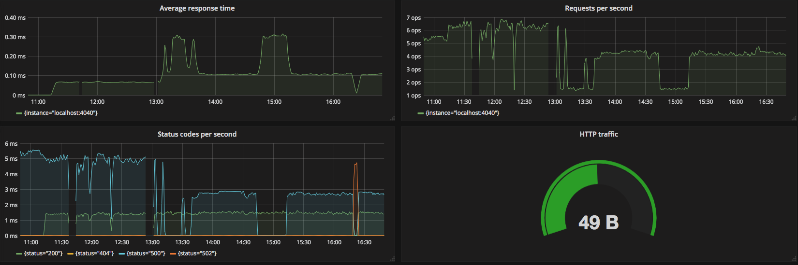
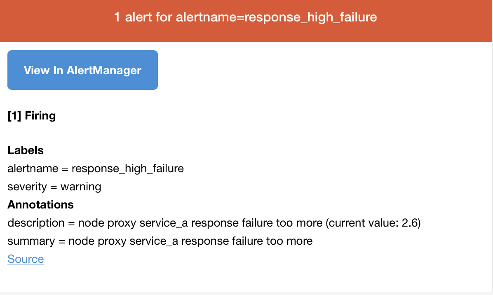

# Nginx Monitor Sample

The visualized and alert method when use Nginx.
You need to be perpared:
> [Nginx](https://nginx.org) (The latest available) 
> [Prometheus](https://prometheus.io) (version>=2.0)
> [Grafana](https://grafana.com) (version>=4.0)
> [prometheus-nginxlog-exporter](https://github.com/martin-helmich/prometheus-nginxlog-exporter)


## Setting Nginx Log Format


```sh
http {
  log_format main  '$remote_addr - $remote_user [$time_local] '
                     '"$request" $status $body_bytes_sent '
                     '"$http_referer" "$http_user_agent" "$http_x_forwarded_for" '
                     'rt=$request_time uct="$upstream_connect_time" uht="$upstream_header_time" urt="$upstream_response_time"';
                     
  access_log  /var/log/nginx/access.log  main;    
  server {
          listen       80;
          server_name  localhost;
          
          location /service_a {
            proxy_pass http://localhost:8080;
          }
}
```

ok, reload nginx

```
nginx -s reload
```

then, we send a http request

```
curl http://localhost/service_a
HTTP/1.1 502 Bad Gateway
Connection: keep-alive
Content-Length: 537
Content-Type: text/html
Date: Sun, 08 Apr 2018 08:19:06 GMT
ETag: "59e602bc-219"
Server: nginx/1.12.2
```

502, Onz

Not Panic, we start business service bind 8080 port.

```
vim demo.go
```


```Go
package main

import (
	"fmt"
	"flag"
	"log"
	"net/http"
	"time"
	"math/rand"

	"github.com/prometheus/client_golang/prometheus/promhttp"
)

var addr = flag.String("listen-address", ":8080", "The address to listen on for HTTP requests.")

func healthCheck(w http.ResponseWriter, r *http.Request) {
	time.Sleep(time.Duration(rand.Intn(600))* time.Millisecond)
	fmt.Fprint(w, "ok")
}

func fakeFailure(w http.ResponseWriter, r *http.Request) {
	w.WriteHeader(500)
	fmt.Fprint(w, "i am failure")
}

func main() {
	flag.Parse()
	http.HandleFunc("/service_a", healthCheck)
	http.HandleFunc("/service_a/failure", fakeFailure)
	http.Handle("/metrics", promhttp.Handler())
	log.Fatal(http.ListenAndServe(*addr, nil))
}

```

start demo service

```
go run demo.go
```

request service_a

```
curl localhost:80/service_a
HTTP/1.1 200 OK
Connection: keep-alive
Content-Length: 2
Content-Type: text/plain; charset=utf-8
Date: Sun, 08 Apr 2018 08:39:56 GMT
Server: nginx/1.12.2

ok
```

Look at nginx log 

```
tail /var/log/nginx/access.log
```

Result:

```
127.0.0.1 - - [08/Apr/2018:16:41:52 +0800] "GET /service_a HTTP/1.1" 200 2 "-" "curl/7.55.1" "-" rt=0.136 uct="0.001" uht="0.136" urt="0.136"
```


Config prometheus-nginxlog-exporter

```
listen {
  port = 4040
}

namespace "service_a" {
  source_files = [
    "/var/log/nginx/logs/access.log"
  ]
  format = "$remote_addr - $remote_user [$time_local] \"$request\" $status $body_bytes_sent \"$http_referer\" \"$http_user_agent\" \"$http_x_forwarded_for\" rt=$request_time uct=\"$upstream_connect_time\" uht=\"$upstream_header_time\" urt=\"$upstream_response_time\""

  labels {
    service = "service-a"
  }

  relabel "request_uri" {
    from = "request"
    split = 2

  }
}

```


Let's config prometheus


### AlertManager Config

- Config Prom

  vim prometheus.yml, append this config

  ```
  rule_files:
    - "alert.rules.yml"

  alerting:
    alertmanagers:
    - static_configs:
      - targets:
        - localhost:9093
        
  scrape_configs:
    - job_name: 'nginx-log-export'
      static_configs:
          - targets: ['localhost:4040']
  ```


  vim alert.rules.yml

```
groups:
- name: alert.rules
  rules:
  - alert: response_high_failure
  	// pass 1 minute, return true if response 5XX code count > 2
    expr: sum(rate(service_a_http_response_count_total{status=~"5.."}[1m])) > 2
    for: 1m
    labels:
      severity: warning
    annotations:
      description: 'node {{ $labels.instance }} proxy service_a response failure too
        more (current value: {{ $value }})'
      summary: node {{ $labels.instance }} proxy service_a response failure too more
```

REMIND:

put `prometheus.yml` and `alert.rules.yml` to `/etc` path

- Config AlertManager

vim alert-default.yml

```
global:
  # The smarthost and SMTP sender used for mail notifications.
  smtp_smarthost: 'smtp_smarthost' ## change to you stmp server
  smtp_from: 'fromhost@someemailhost.com'	 ## change to you stmp from account
  smtp_auth_username: 'drwho@someemailhost.com'	## change to you stmp user account
  smtp_auth_password: 'passwd'	## change to you passwd

  resolve_timeout: 1m

templates:
  - '/etc/alertmanager/template/*.tmpl'
   
route:

  group_by: ['alertname', 'cluster', 'service']
   
  group_wait: 30s
   
  group_interval: 5m
   
  repeat_interval: 5m

  receiver: oscar-appahoc-email
   
  routes:
  
    - match_re:
        service: ^nginx-log-export&	// match `prometheus.yml - scrap_configs.job`
      receiver: drwho
      
      routes:
      - match:
          severity: critical
        receiver: oscar-appahoc-email
   
    - match:
        service: files
      receiver: oscar-appahoc-email
      routes:
      - match:
          severity: critical
        receiver: oscar-appahoc-email


inhibit_rules:
  - source_match:
      severity: 'critical'
    target_match:
      severity: 'warning'
    equal: ['alertname', 'cluster', 'service']
   

receivers:
  - name: 'drwho'
    email_configs:
      - to: 'somereceiver@emailhost.com'
        require_tls: false
        send_resolved: true
   
```


Next, we explore Grafana

Start grafana service, and open default http port 3000 on brower.

Login in by admin/admin

Settting datasource to prometheus

Import Dashboard by `grafana_nginx_dashboard.json`

Open a Terminal 

```
while true; do curl -i http://localhost:80/service_a; done
```

Once again

```
while true; do curl -i http://localhost:80/service_a; done
```

Open a Terminal 

```
while true; do curl -i http://localhost:80/service_a/failure; done
```

Once again

```
while true; do curl -i http://localhost:80/service_a/failure; done
```

Open dashboard in Grafana




Wait a cup coffer time, you will recevie email





[Prometheus Configuration](https://prometheus.io/docs/prometheus/latest/configuration/configuration/)

[Prometheus Querying](https://prometheus.io/docs/prometheus/latest/querying/basics/)

[AlertManger Configuration](https://prometheus.io/docs/alerting/configuration/)


